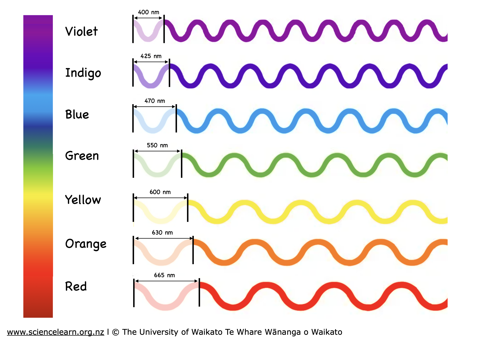
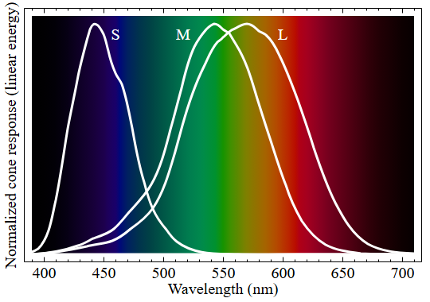
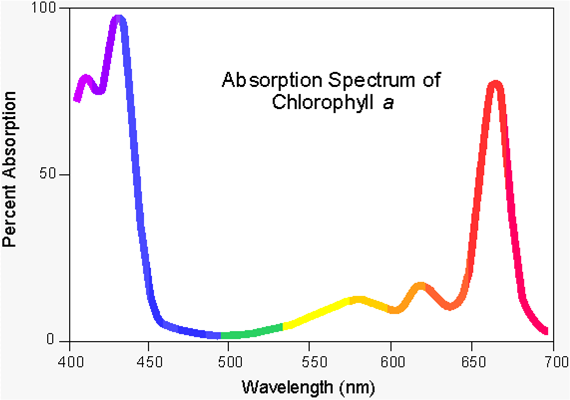
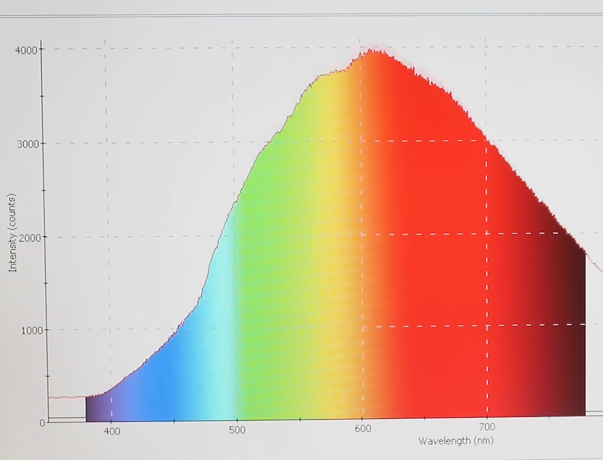
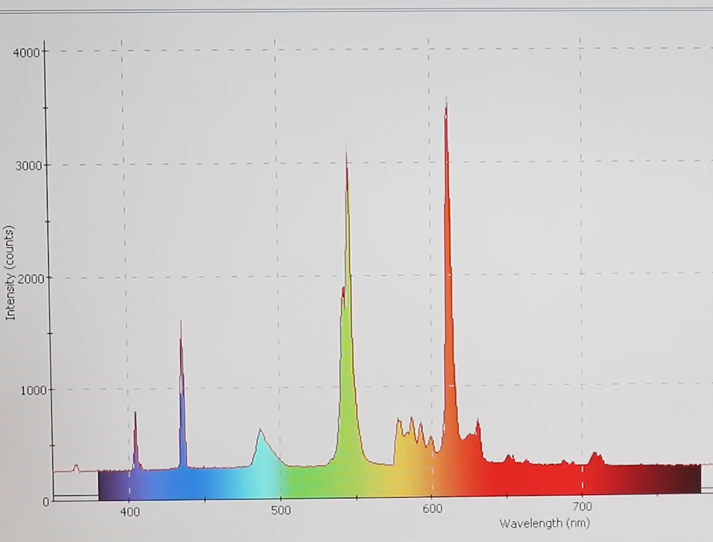
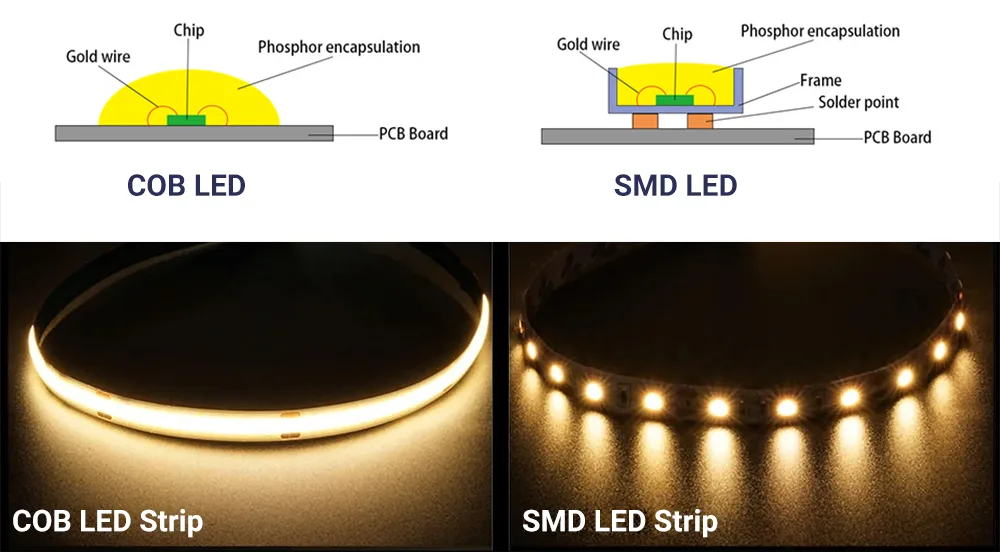

I dove down the rabbithole of DIY LED strips and now you have to suffer with me.

# The parts

- The LED strip itself
- the controller, which handles:
  - power delivery
  - dimming/color change
  - wifi/smart/IR connections
- the power supply

There ARE products where these are built together into one package, however they're usually 2x the price and less customizable. Let's look at each part from least complex to most!

# The power supply

LEDs run off DC power (constant voltage), and your wall provides AC power (oscillating voltage). The power supply converts AC from your wall to DC.

You need to make sure: 
- the voltage (V) of your power supply is compatible with your controller and LED strip
- the amperage (A) is sufficient for how much power the LEDs and controller will draw
- the physical connector is compatible with your controller (sometimes they're different or missing one entirely)

But beyond that, it isn't hard to find a specific voltage and amp power supply and buy a well-rated amazon one.

# The controller

The controller's job is to let you control the LEDs: their brightness/color.

## Methods of control

Different controllers can be controlled in very different ways. There's a physical button on most controllers to quickly toggle them. Some have physical infrared remotes with buttons to change the color. And some are controlled via smarthome systems.

There's like a thousand different smarthome protocols. Some operate over the internet and the cloud (alexa, google), but many others work fully locally without requiring internet. There's bluetooth control, Zigbee control, Matter (a new and open source protocol, compatible with most smart home systems including Apple's and modern Alexas), and more niche open source protocols like ESPHome or WLED, which work well with Home Assistant.

## LED compatability

Later in this post I'll talk about the bajillion types of LED strips out there, and for each new feature, you have to ensure that the controller you buy supports that feature.

Fundamentally, there are specific wires each LED strip will have (red, green, blue, cool white, ground, power, serial data, etc.), and you need to make sure that your controller has a terminal for each wire your LED strip has.

## How you use them

So most controllers connect to the LEDs via individual wires from the strip being screwed into wire terminals on the controller. Just make sure the right wire goes in the right terminal, plug it into power, and that's it.

# The strip itself

The main part. The thing we actually care about. The part with the most variation and choice.

## How many colors

This is one of the more important variations between strips. Different strips have different amounts of colored LEDs, which affect which colors it can be and how good the light quality is.

- Single color strips do exist, typically warm, cool, or neutral white.
- "Controllable Color Temperature"/CCT. These strips have separate warm white and cool white "subpixels", which can be individually dimmed to shift the temperature of the white light it makes
- RGB (red, green, blue): These use the same colored subpixels as most screens do, to be able to make light of any color! However, to many, the "quality" of the white light that RGB strips produce is not as good as white light produced by real white subpixels. (See my tangent on light quality below.)
- The rest of the types are some combination of these 3 types:

| strip type | white subpixel | warm AND cool white | RGB |
|------------|----------------|---------------------|-----|
| white      | ✔️             |                     |     |
| CCT        | ✔️             | ✔️                  |     |
| RGB        |                |                     | ✔️  |
| RGBW       | ✔️             |                     | ✔️  |
| RGBCCT     | ✔️             | ✔️                  | ✔️  |

**The more types of subpixels a strip has, the more expensive it (and its controller) will be!**

### A brief tangent on light quality

Feel free to skip this, but here's a short science lecture to explain what light quality means.

If RGB strips can produce any color, why would they produce "bad quality" white light? What is light quality? Here's a quick summary:

What we percieve as "color" is the way we percieve a fact about light: light acts (partially) like a wave, and all light has a "wavelength".

[(Image by The Science Learning Hub Pokapū Akoranga Pūtaiao)](https://www.sciencelearn.org.nz/resources/47-colours-of-light)

The human eye perceives this by having three separate "cone cells" in the eye that individually respond to different ranges of wavelengths. The 3 types are: red/long, green/medium, and blue/short. The long/medium/short names come from the wavelengths physically being closer or farther apart for each color.

Here's where the brain gets clever. The cone cells response to wavelengths overlaps. So, if nearby cone cells detect, for example, light with a wavelength halfway between the peaks of red and green, what your brain actually detects is both red AND green cone cells firing at the same time. And the human brain is smart enough to put together that "if I perceive red and green, that must be yellow!" and the brain can then tell apart different wavelengths of light, and that is what "color" is.

But "color" is not a perfect sense of a light's wavelength. It's an abstraction our brain presents to us. 

And, it turns out, the sense starts to differ when there are multiple different wavelengths of light mixed together. The human eye cannot tell the difference between pure yellow light, and a mix of red and green light, because all the brain can detect is that there is reddish and greenish light in both cases.

It gets even weirder when you use mixtures of light to create a "color" that cannot be made by any wavelength. For example, there is no such thing as magenta light. What we call "magenta" is the perception of the red and blue cone cells firing at the same time. However, because their detection ranges don't overlap much, there isn't a single wavelength of light that is "magenta", but a mixture of light is.

Here's the weird part, opaque things *selectively* absorb different wavelengths of light. 

So if an object *absorbs* (what we see as) red and blue light, but *reflects* green light back at it, the human brain perceives this object as "green", even though the light elsewhere in the room is NOT seen as "green".

An example of an absorbance spectrum (a graph of which wavelengths an object reflects/emits):

[credit](https://public.websites.umich.edu/~chem125/softchalk/Exp2_Final_2/Exp2_Final_2_print.html)

THIS is why we prefer white light sources. Because "white" is what we see when red, green, and blue cone cells all fire at the same time, "white" is a BROAD range of MANY light wavelengths (which is produced by hot objects like the sun via a process called "blackbody radiation"). And since different materials have very very different "choices" of wavelengths of light that they reflect or absorb, we are able to tell apart different objects by sight, and THAT is why life evolved the ability to see color.

Now we can connect this back to the topic.

A mixture of red, green, and blue light (that might be produced by an RGB LED strip), LOOKS white when you look right at it, because it activates all three types of cone cells, but it is not the same as white light emitted by a hot object (which produces a continuous spectrum of wavelengths of light, not just red, green, and blue).

Why would this be a problem? Well, what if there was an object that absorbed almost all wavelengths of light except one halfway between red and green? With **"high quality"** white light, light that is a broad continuous spectrum of wavelengths, there would be yellow light that the object would reflect and our eyes would see normally. BUT, if the object was lit with **"low quality"** white light, which is only made of pure red, green, and blue light, there **isn't any orange light for the object to reflect**, so it would actually look DARKER under "low quality" white light, even though the light itself appears the same color as "high quality" white light.

This is what "high quality" white light looks like:

(incandescent bulb, credit ElectroBoom)

And this is what "low quality" white light looks like:

(fluorescent bulb, credit ElectroBoom)

TL;DR low quality white light, which "RGB" LEDs make, makes some objects look the wrong color!

## LED density

Standard strips, sometimes called IC or SMD, have big LEDs with noticeable gaps between them.

"Chip on Board"/COB strips have LEDs which are much smaller, closer together, and with minimal visible gap between them. 

[(Image credit signliteled.com)](https://www.signliteled.com/difference-between-smd-led-and-cob-led-which-is-better/)

COB strips look nicer but are more expensive.

## SPI vs PWM

Don't worry about what the acronyms mean. "SPI" means that each LED can can individually change color, where PWM means the entire strip physically can only be one color at a time. SPI strips, and compatible controllers, are much more expensive.

## Strip chaining

Most strips, such as those that I use from BTF-Lighting, can be chained together to make a longer strip from a single controller and power source. This lets you make much longer strips than you can buy, as long as your power supply and controller are enough to power them. 

# Conclusion

By using what you have learned to pick out the right type of LED strip, controller, and supply for you, you can massively improve the lighting in your living space to perfectly suit your needs, and do it for much cheaper than many packaged together solutions!!